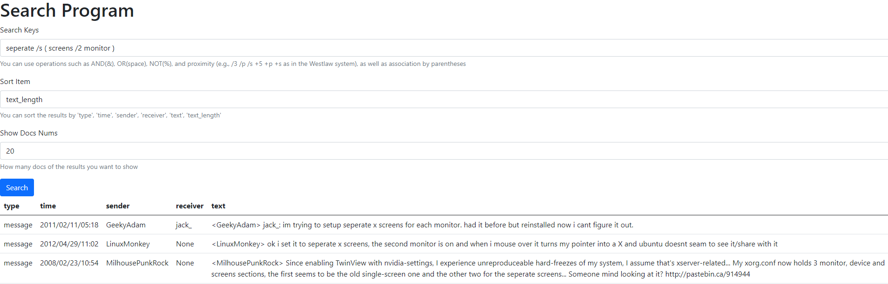

# BSTS
BSTS (Boolean and Spell-correction with Tolerant Search) is the implementation for the Web Search &amp; Mining course, which contains data crawling (Ubuntu IRC  data (2004~2021)) and preprocessing, boolean search, spell-correction with tolerant (fuzzy) search and simple web interface

You can use operations such as AND(&), OR(space), NOT(%), and proximity (e.g., /3 /p /s +5 +p +s as in the Westlaw system), as well as association by parentheses.

You can sort the results by 'type', 'time', 'sender', 'receiver', 'text', 'text_length'.

You can set how many docs of the results you want to show.

# How to use
To begin with, you need to modify the all the `dir_path` and `file_path` according to you machine. The original codes are tested on Ubuntu. 
- Firstly, get `conda` and install related packages in a virtual environment using `wsm.yml`:
  ```
  wget https://repo.anaconda.com/miniconda/Miniconda3-py39_4.9.2-Linux-x86_64.sh
  sh Miniconda3-py39_4.9.2-Linux-x86_64.sh
  ``` 
  Select 'yes' all the way through.
  
  ```
  conda env create -n wsm -f environment.yml
  conda activate wsm
  ```
  You can change the env name ('wsm') as you want. 
- Then, you need to craw the data from https://irclogs.ubuntu.com/ using `Spider.py`:
  ```
  python Spider.py
  ```
  Since the data is large (almost 30GB) and the number of files is also large, HttpError may rise and `Spider.py` may exits. You can modify the `range(start, end)` in the codes to restart the downloading. 
- Finally you can run `AutoAfterSpider.sh` for auto running:
  ```
  sh AutoAfterSpider.sh
  ```
  Or, you can run the codes respectively in the following order:
  ```
  # several minutes
  python PreProcessing.py

  # several hours
  python Postings.py

  # several minutes
  python AllWords.py
  python BuildWordDict.py
  python DocIdx.py

  # start the search engine and web interface
  python Search.py
  ```

# Web Interface Demo
